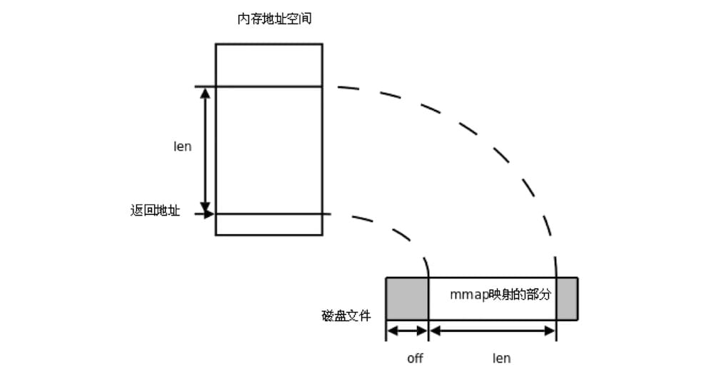

## 1 mmap overview

> In computing, mmap is a POSIX-compliant Unix system call that maps files or devices into memory. It is a method of memory-mapped file I/O.
> -- [mmap - wikipedia.org](https://en.wikipedia.org/wiki/Mmap)

Put simply, mmap maps a file or device into memory, establishing a one-to-one mapping between the file's on-disk address and a range of virtual addresses in the process's virtual address space. This means that, within a process, you can read and write the file by operating on that mapped region of memory. When you modify the contents of the mapped memory, the corresponding part of the file changes as well; and reading that memory is equivalent to reading the file at the corresponding position.

Another very important property of mmap is that it reduces the number of memory copies. On Linux, file reads and writes are usually performed with the read and write system calls, a process that involves frequent memory copies. The read function alone involves 2 copies:

- 1) the OS reads the file from disk into the page cache;
- 2) the data is copied from the page cache into the buf passed to read (for example, a byte array created in the process).

With mmap, only one copy is needed: the OS reads the file from disk into the page cache, and the process modifies the mapped memory directly through a pointer. That makes mmap especially well suited to workloads with frequent reads and writes — it cuts down on memory copies, improves efficiency, and simplifies the code. The KV database [bbolt](https://github.com/etcd-io/bbolt) uses exactly this approach to persist data.

## 2 mmap in the standard library

The Go standard-library package [golang.org/x/exp/mmap](https://godoc.org/golang.org/x/exp/mmap) only implements the read operation, and whether write support will come later is unknown, so its use cases are quite limited. Here is a simple example:

Read 2 bytes of tmp.txt starting from the 4th byte.

```go
package main

import (
	"fmt"
	"golang.org/x/exp/mmap"
)

func main() {
	at, _ := mmap.Open("./tmp.txt")
	buff := make([]byte, 2)
	_, _ = at.ReadAt(buff, 4)
	_ = at.Close()
	fmt.Println(string(buff))
}
```

```bash
$ echo "abcdefg" > tmp.txt
$ go run .
ef
```

The code is almost identical if you use `os.File`, which also supports the write operation `WriteAt`:

```go
package main

import (
	"fmt"
	"os"
)

func main() {
	f, _ := os.OpenFile("tmp.txt", os.O_CREATE|os.O_RDWR, 0644)
	_, _ = f.WriteAt([]byte("abcdefg"), 0)

	buff := make([]byte, 2)
	_, _ = f.ReadAt(buff, 4)
	_ = f.Close()
	fmt.Println(string(buff))
}
```

## 3 mmap (Linux)

To support write operations, you have to call the mmap system call directly. Both Linux and Windows support mmap, but their interfaces differ. On Linux, the mmap function is defined as follows:

```go
func Mmap(fd int, offset int64, length int, prot int, flags int) (data []byte, err error)
```

The parameters are:

```go
- fd: the file descriptor of the file to map.
- offset: the starting position of the region to map; 0 means the kernel chooses the memory address.
- length: the size of the memory region to map.
- prot: memory protection flags, which can be combined with the bitwise OR operator `|`
    - PROT_EXEC  // pages can be executed
    - PROT_READ  // pages can be read
    - PROT_WRITE // pages can be written
    - PROT_NONE  // pages cannot be accessed
- flags: the type of the mapping object; the two most common are
    - MAP_SHARED  // shared mapping: writes are copied back to the file and shared with other processes that map the file.
    - MAP_PRIVATE // creates a private copy-on-write mapping: writes do not affect the original file.
```

First, define two constants and the Demo type:

```go
const defaultMaxFileSize = 1 << 30        // assume the file is at most 1G
const defaultMemMapSize = 128 * (1 << 20) // assume the mapped memory size is 128M

type Demo struct {
	file    *os.File
	data    *[defaultMaxFileSize]byte
	dataRef []byte
}

func _assert(condition bool, msg string, v ...interface{}) {
	if !condition {
		panic(fmt.Sprintf(msg, v...))
	}
}
```

- Memory is paged, so the mapped physical memory can be far smaller than the file.
- The Demo struct consists of 3 fields: file is the file descriptor, data is the starting address of the mapped memory, and dataRef is used to unmap it later.

Define three methods: mmap, grow and munmap:

```go
func (demo *Demo) mmap() {
	b, err := syscall.Mmap(int(demo.file.Fd()), 0, defaultMemMapSize, syscall.PROT_WRITE|syscall.PROT_READ, syscall.MAP_SHARED)
	_assert(err == nil, "failed to mmap", err)
	demo.dataRef = b
	demo.data = (*[defaultMaxFileSize]byte)(unsafe.Pointer(&b[0]))
}

func (demo *Demo) grow(size int64) {
	if info, _ := demo.file.Stat(); info.Size() >= size {
		return
	}
	_assert(demo.file.Truncate(size) == nil, "failed to truncate")
}

func (demo *Demo) munmap() {
	_assert(syscall.Munmap(demo.dataRef) == nil, "failed to munmap")
	demo.data = nil
	demo.dataRef = nil
}
```

- The protection flags passed to mmap are `syscall.PROT_WRITE|syscall.PROT_READ` (readable and writable), and the mapping type is `syscall.MAP_SHARED`, so modifications to the memory are synced to the file.
- `syscall.Mmap` returns a slice; you need to get the starting address of the mapped memory from that slice and convert it into a usable byte array, whose length is `defaultMaxFileSize`.
- grow changes the size of the file. Linux does not allow access to memory addresses beyond the file size. For example, if the file is 4K, the accessible addresses are `data[0~4095]`, and accessing `data[10000]` raises an error.
- munmap unmaps the memory.

Write `hello, geektutu!` into the file:

```go
func main() {
	_ = os.Remove("tmp.txt")
	f, _ := os.OpenFile("tmp.txt", os.O_CREATE|os.O_RDWR, 0644)
	demo := &Demo{file: f}
	demo.grow(1)
	demo.mmap()
	defer demo.munmap()

	msg := "hello geektutu!"

	demo.grow(int64(len(msg) * 2))
	for i, v := range msg {
		demo.data[2*i] = byte(v)
		demo.data[2*i+1] = byte(' ')
	}
}
```

- `grow(1)` is called before `mmap`; because `mmap` uses `&b[0]` to get the starting address of the mapped memory, the file must be at least 1 byte.
- After that, the file's contents are modified simply by operating on `demo.data` directly.

Run it:

```bash
$ go run .
$ cat tmp.txt
h e l l o   g e e k t u t u !
```

## 4 mmap (Windows)

Compared with Linux, using mmap on Windows is a bit more involved.

```go
func (demo *Demo) mmap() {
	h, err := syscall.CreateFileMapping(syscall.Handle(demo.file.Fd()), nil, syscall.PAGE_READWRITE, 0, defaultMemMapSize, nil)
	_assert(h != 0, "failed to map", err)

	addr, err := syscall.MapViewOfFile(h, syscall.FILE_MAP_WRITE, 0, 0, uintptr(defaultMemMapSize))
	_assert(addr != 0, "MapViewOfFile failed", err)

	err = syscall.CloseHandle(syscall.Handle(h));
	_assert(err == nil, "CloseHandle failed")

	// Convert to a byte array.
	demo.data = (*[defaultMaxFileSize]byte)(unsafe.Pointer(addr))
}

func (demo *Demo) munmap() {
	addr := (uintptr)(unsafe.Pointer(&demo.data[0]))
	_assert(syscall.UnmapViewOfFile(addr) == nil, "failed to munmap")
}
```
- It takes two steps, `CreateFileMapping` and `MapViewOfFile`, to complete the memory mapping. `MapViewOfFile` returns the address of the mapped memory, so that address can be converted into a byte array directly.
- Windows puts no requirement on the file size: operate on the memory `data` directly and the file size changes automatically.

So there is no need to worry about the file size when using it.

```go
func main() {
	_ = os.Remove("tmp.txt")
	f, _ := os.OpenFile("tmp.txt", os.O_CREATE|os.O_RDWR, 0644)
	demo := &Demo{file: f}
	demo.mmap()
	defer demo.munmap()

	msg := "hello geektutu!"
	for i, v := range msg {
		demo.data[2*i] = byte(v)
		demo.data[2*i+1] = byte(' ')
	}
}
```

```go
$ go run .
$ cat .\tmp.txt
h e l l o   g e e k t u t u !
```

## Notes

This article is hosted on [GitHub](https://github.com/geektutu/geektutu.github.io) — typo fixes and PRs are welcome. Thanks for reading.

- [edsrzf/mmap-go - github.com](https://github.com/edsrzf/mmap-go)
- [syscall in the official Go documentation - golang.org](https://golang.org/pkg/syscall/)

> The Chinese original of this article is available at [geektutu.com/post/quick-go-mmap.html](https://geektutu.com/post/quick-go-mmap.html).
