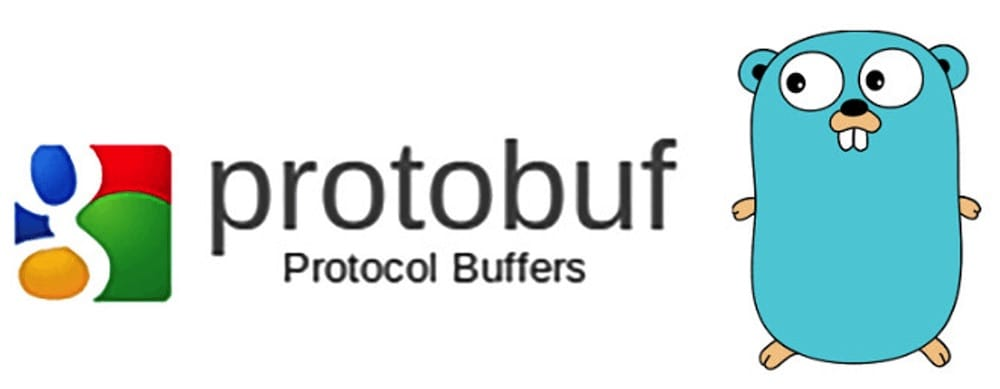

## 1 Introduction to Protocol Buffers

Protocol Buffers (protobuf) is a lightweight and efficient structured data storage format that is language- and platform-neutral, scalable and serializable. In terms of performance and efficiency, protobuf significantly outperforms other structured data formats such as JSON and XML. protobuf is stored in binary: it takes up little space, at the cost of poor readability. protobuf is widely used in areas such as communication protocols and data storage. For example, [groupcache](https://github.com/golang/groupcache), the Go version of the well-known distributed caching tool [Memcached](https://memcached.org/), uses protobuf as its RPC data format.

With protobuf, you define the structured data you want to process in `.proto` files, and the `protoc` tool can convert `.proto` files into code for many languages, including C, C++, Golang, Java and Python — good compatibility, easy to use.

## 2 Installation

### 2.1 protoc

Download the latest release package from [Protobuf Releases](https://github.com/protocolbuffers/protobuf/releases) and install it. On Ubuntu, you can follow the steps below (3.11.2 as an example).

```bash
# download the package
$ wget https://github.com/protocolbuffers/protobuf/releases/download/v3.11.2/protoc-3.11.2-linux-x86_64.zip
# extract it to /usr/local
$ sudo 7z x protoc-3.11.2-linux-x86_64.zip -o/usr/local
```

If you don't want to install it under /usr/local, extract it to another directory and add the bin directory under the extraction path to your PATH.

If the version is displayed correctly, the installation succeeded.

```bash
$ protoc --version
libprotoc 3.11.2
```

### 2.2 protoc-gen-go

To use protobuf in Golang, we also need to install protoc-gen-go, the tool that converts `.proto` files into Golang code.

```bash
go get -u github.com/golang/protobuf/protoc-gen-go
```

protoc-gen-go will be installed automatically into `$GOPATH/bin`; you need to add this directory to your PATH as well.

## 3 Defining Message Types

Next, let's create a very simple example, `student.proto`:

```go
syntax = "proto3";
package main;

// this is a comment
message Student {
  string name = 1;
  bool male = 2;
  repeated int32 scores = 3;
}
```

Run the following in the current directory:

```bash
$ protoc --go_out=. *.proto
$ ls
student.pb.go  student.proto
```

This converts all the .proto files in the directory into Go code. As you can see, a new Go file *student.pb.go* appears in the directory. It defines a Student struct and related methods:

```go
type Student struct {
	Name string `protobuf:"bytes,1,opt,name=name,proto3" json:"name,omitempty"`
	Male bool `protobuf:"varint,2,opt,name=male,proto3" json:"male,omitempty"`
	Scores []int32 `protobuf:"varint,3,rep,packed,name=scores,proto3" json:"scores,omitempty"`
	...
}
```

A line-by-line walkthrough of `student.proto`:

- protobuf has two versions, and the default is proto2. If you want proto3, declare it with `syntax = "proto3"` on the first non-empty, non-comment line.
- `package`, the package name declaration, is optional and is used to prevent naming conflicts between different message types.
- Message types are defined with the `message` keyword: Student is the type name, and name, male and scores are its 3 fields, of type string, bool and []int32 respectively. Fields can be scalar types or composite types.
- The default field modifier is singular and is usually omitted; `repeated` means the field can repeat, i.e. it corresponds to an array type in Go.
- The number after `=` of each field is called the identifier. Every field must be given a unique identifier. Identifiers identify each field in the binary format of the message, cannot be changed once used, and must be in the range [1, 2^29 - 1].
- .proto files support comments: `//` for single-line and `/* ... */` for multi-line.
- A .proto file can define multiple message types, which correspond to multiple structs.

Next, you can start using it directly in your project code. Here is a very simple example proving that the serialized and deserialized instances contain the same data.

```go
package main

import (
	"log"

	"github.com/golang/protobuf/proto"
)

func main() {
	test := &Student{
		Name: "geektutu",
		Male:  true,
		Scores: []int32{98, 85, 88},
	}
	data, err := proto.Marshal(test)
	if err != nil {
		log.Fatal("marshaling error: ", err)
	}
	newTest := &Student{}
	err = proto.Unmarshal(data, newTest)
	if err != nil {
		log.Fatal("unmarshaling error: ", err)
	}
	// Now test and newTest contain the same data.
	if test.GetName() != newTest.GetName() {
		log.Fatalf("data mismatch %q != %q", test.GetName(), newTest.GetName())
	}
}
```

- Reserved Fields

When updating a message type, you may remove some fields/identifiers. These removed fields/identifiers might get reused later; if data from an older version is then loaded, it can cause data conflicts. When upgrading, you can reserve these fields/identifiers so that they will not be reused — protoc will check for this.

```go
message Foo {
  reserved 2, 15, 9 to 11;
  reserved "foo", "bar";
}
```


## 4 Field Types

### 4.1 Scalar Types

| proto type | go type | Notes | proto type | go type | Notes |
|---|---|---|---|---|---|
| double | float64 | | float | float32 ||
| int32 | int32 | | int64 | int64 | |
| uint32 | uint32 | |uint64 | uint64 | |
| sint32 | int32 | efficient for negative numbers | sint64 | int64 | efficient for negative numbers |
| fixed32 | uint32 | fixed-length encoding, efficient for values above 2^28 | fixed64 | uint64 | fixed-length encoding, efficient for values above 2^56 |
| sfixed32 | int32 | fixed-length encoding | sfixed64 | int64 | fixed-length encoding |
| bool | bool | |string|string| UTF-8 encoded, up to 2^32 in length |
| bytes | []byte | arbitrary byte sequence, up to 2^32 in length |

If a scalar field is not set, it won't be serialized; when parsed, it is assigned a default value:

- strings: empty string
- bytes: empty sequence
- bools: false
- numeric types: 0

### 4.2 Enumerations

Enum types are suitable for providing a set of predefined values and choosing one of them. For example, we can define gender as an enum type.

```go
message Student {
  string name = 1;
  enum Gender {
    FEMALE = 0;
    MALE = 1;
  }
  Gender gender = 2;
  repeated int32 scores = 3;
}
```

- The identifier of the first option of an enum must be 0; it is also the default value of the enum type.
- Alias: you may give different enum values the same identifier — this is called an alias and requires enabling the `allow_alias` option.

```go
message EnumAllowAlias {
  enum Status {
    option allow_alias = true;
    UNKOWN = 0;
    STARTED = 1;
    RUNNING = 1;
  }
}
```

### 4.3 Using Other Message Types

`Result` is another message type, used as a message field type in SearchResponse.

```go
message SearchResponse {
  repeated Result results = 1; 
}

message Result {
  string url = 1;
  string title = 2;
  repeated string snippets = 3;
}
```

Nesting is also supported:

```go
message SearchResponse {
  message Result {
    string url = 1;
    string title = 2;
    repeated string snippets = 3;
  }
  repeated Result results = 1;
}
```

If they are defined in other files, you can import those message types for use:

```go
import "myproject/other_protos.proto";
```

### 4.4 Any

Any can represent arbitrary types that are not defined in your .proto files.

```go
import "google/protobuf/any.proto";

message ErrorStatus {
  string message = 1;
  repeated google.protobuf.Any details = 2;
}
```

### 4.5 oneof

```go
message SampleMessage {
  oneof test_oneof {
    string name = 4;
    SubMessage sub_message = 9;
  }
}
```

### 4.6 map

```go
message MapRequest {
  map<string, int32> points = 1;
}
```

## 5 Defining Services

If your message types are used for remote communication (Remote Procedure Call, RPC), you can define RPC service interfaces in the .proto file. For example, we define an RPC service named SearchService that provides a `Search` method, taking a `SearchRequest` and returning a `SearchResponse`:

```go
service SearchService {
  rpc Search (SearchRequest) returns (SearchResponse);
}
```

The official repository also provides a [list of plugins](https://github.com/protocolbuffers/protobuf/blob/master/docs/third_party.md) to help you develop RPC services based on Protocol Buffers.

## 6 Other protoc Options

Command-line usage:

```bash
protoc --proto_path=IMPORT_PATH --<lang>_out=DST_DIR path/to/file.proto
```

- `--proto_path=IMPORT_PATH`: .proto files can import other .proto files; proto_path specifies the directory to search for those imported .proto files. If you don't import other .proto files, this option can be omitted.
- `--<lang>_out=DST_DIR`: specifies the target directory for the generated code; for example, --go_out=. generates Go code in the current directory. Other languages are also supported: cpp/java/python/ruby/objc/csharp/php, etc.

## 7 Recommended Style

- Files
    - File names use the lower_snake_case style, e.g. lower_snake_case.proto
    - No more than 80 characters per line
    - Indent with 2 spaces

- Packages
    - Package names should match the directory structure: if a file lives in the `my/package/` directory, the package name should be `my.package`

- Messages & Fields
    - Message names use CamelCase, e.g. `message StudentRequest { ... }`
    - Field names use the lower_snake_case style, e.g. `string status_code = 1`
    - Enums: enum names use CamelCase, e.g. `enum FooBar`; enum values use CAPITALS_WITH_UNDERSCORES, e.g. FOO_DEFAULT=1

- Services
    - RPC service names and method names both use CamelCase, e.g. `service FooService{ rpc GetSomething() }`

## Notes & references

This article is hosted on [GitHub](https://github.com/geektutu/geektutu.github.io) — typo fixes and PRs are welcome. Thanks for reading.

1. [protobuf repository - github.com](https://github.com/protocolbuffers/protobuf)
2. [golang protobuf repository - github.com](https://github.com/golang/protobuf)
3. [Remote procedure call - wikipedia.org](https://en.wikipedia.org/wiki/Remote_procedure_call)
4. [groupcache, the Go version of memcached - github.com](https://github.com/golang/groupcache)
5. [Language Guide (proto3), the official guide - google.com](https://developers.google.com/protocol-buffers/docs/proto3)
6. [Proto Style Guide, the code style guide - google.com](https://developers.google.com/protocol-buffers/docs/style)
7. [Protocol Buffer plugin list - github.com](https://github.com/protocolbuffers/protobuf/blob/master/docs/third_party.md)

> The Chinese original of this article is available at [geektutu.com/post/quick-go-protobuf.html](https://geektutu.com/post/quick-go-protobuf.html).
