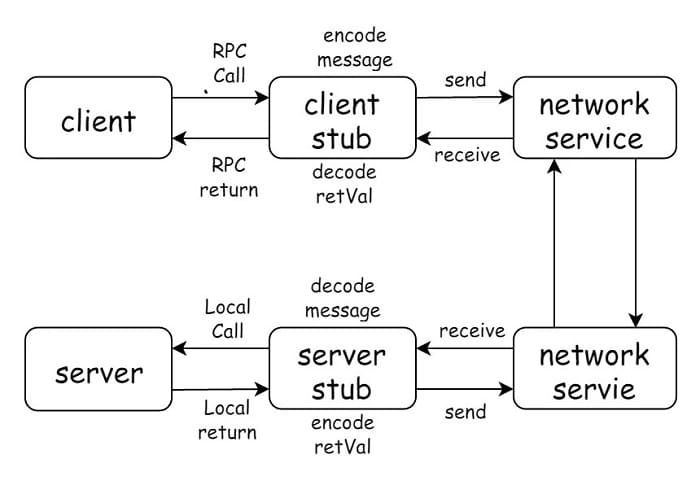

This article introduces how to use Remote Procedure Call (RPC) in Go. The examples are based on Golang's standard library net/rpc, and it also covers how to implement one-way and mutual authentication between the server and the client with TLS/SSL.

## 1 Introduction to RPC

> A remote procedure call (RPC) is a computer communication protocol. It allows a program running on one computer to invoke a subroutine in another address space (typically on a computer on an open network), while the programmer codes it as if it were a local call, with no extra programming needed for the remote interaction (no need to worry about the details). RPC follows a server-client (Client/Server) model, and its classic implementation is a system that exchanges information by sending requests and receiving responses.
> -- [Remote procedure call - Wikipedia.org](https://en.wikipedia.org/wiki/Remote_procedure_call)

Key takeaway: **the programmer calls it just like a local program, without worrying about the details**

The RPC protocol assumes that some transport protocol (TCP, UDP) exists to carry the data between the communicating programs. When using RPC, you don't need to care about the underlying network technology or protocols — calling a remote method feels just like calling a local one.

The RPC flow:



The RPC model is a typical client-server (Client-Server, CS) model. Compared with calling a local interface, RPC additionally requires knowing the server's address. A local call is like two people talking face to face, while RPC is like making a phone call: you need to know the other party's phone number, but you don't need to care about how the voice is encoded, how it is transmitted, or how it is decoded.

Next, we will show how to transform a simple program that uses local calls into an RPC service, step by step.

The examples are written in Go, and the RPC part uses the `net/rpc` package from the Go standard library.

## 2 A Simple Program That Squares a Number

Ignoring RPC and considering only the local-call scenario, the program looks like this:

```go
// main.go
package main

import "log"

type Result struct {
	Num, Ans int
}

type Cal int

func (cal *Cal) Square(num int) *Result {
	return &Result{
		Num: num,
		Ans: num * num,
	}
}

func main() {
	cal := new(Cal)
	result := cal.Square(12)
	log.Printf("%d^2 = %d", result.Num, result.Ans)
}
```

In this 20-line program, we did the following:

- The `Cal` struct provides the Square method, which computes the square of the input parameter num.
- The `Result` struct contains two fields, Num and Ans: Ans is the computed value, and Num is the value to be computed.
- The `main` function tests the Square method we implemented.

Running main.go will output:

```go
$ go run main.go
2020/01/13 20:27:08 12^2 = 144
```

## 3 What Conditions Must an RPC Method Meet

Although RPC means we don't need to care about encoding/decoding or how the communication happens, at the very least a method must satisfy certain constraints and conventions to support remote procedure calls. These constraints and conventions differ between RPC frameworks. If you use Golang's standard library `net/rpc`, the method must look like this:

```go
func (t *T) MethodName(argType T1, replyType *T2) error
```

That is, it must meet the following 5 conditions:

- 1) The method's type (T) is exported (begins with a capital letter)
- 2) The method name (MethodName) is exported
- 3) The method has two arguments (argType T1, replyType *T2), both of exported/built-in types
- 4) The method's second argument is a pointer (replyType *T2)
- 5) The method's return type is error

`net/rpc` is quite strict about the number of arguments: there can only be two. The first argument is the request parameter provided by the caller, and the second is the response parameter returned to the caller — in other words, the server must write the computed result into the second argument. If an error occurs during the call, an error is returned to the caller.

Next, let's adapt the Square function so that it satisfies the 5 conditions above.

```go
func (cal *Cal) Square(num int, result *Result) error {
	result.Num = num
	result.Ans = num * num
	return nil
}

func main() {
	cal := new(Cal)
	var result Result
	cal.Square(11, &result)
	log.Printf("%d^2 = %d", result.Num, result.Ans)
}
```

- Cal and Square are both exported, satisfying conditions 1) and 2)
- There are 2 arguments: `num int` is a built-in type and `result *Result` is an exported type, satisfying condition 3)
- The second argument `result *Result` is a pointer, satisfying condition 4)
- The return type is error, satisfying condition 5)

At this point, the method Cal.Square meets all 5 conditions for an RPC call.

## 4 RPC Server and Calls

### 4.1 Starting the RPC Server over HTTP

RPC is a typical client-server (Client-Server, CS) architecture, so clearly the Cal.Square method needs to live on the server side. The server must provide a socket service that handles the requests sent by clients. Usually this is done over HTTP: listen on a port and wait for HTTP requests.

Next, we create a new folder named server, move the Cal.Square method into server/main.go, and start the RPC service in the main function.

```go
// server/main.go
package main

import (
	"log"
	"net"
	"net/http"
	"net/rpc"
)

type Result struct {
	Num, Ans int
}

type Cal int

func (cal *Cal) Square(num int, result *Result) error {
	result.Num = num
	result.Ans = num * num
	return nil
}

func main() {
	rpc.Register(new(Cal))
	rpc.HandleHTTP()

	log.Printf("Serving RPC server on port %d", 1234)
	if err := http.ListenAndServe(":1234", nil); err != nil {
		log.Fatal("Error serving: ", err)
	}
}
```

- `rpc.Register` publishes the methods of Cal that satisfy the RPC registration conditions (Cal.Square)
- `rpc.HandleHTTP` registers the HTTP handler used to process RPC messages
- `http.ListenAndServe` listens on port 1234 and waits for RPC requests.

Run this in the server directory:

```bash
$ go run main.go
2020/01/13 20:59:22 Serving RPC server on port 1234
```

The RPC service is now up and waiting for client calls.

### 4.2 Implementing the Client

We create a new file client/main.go in the client directory. It sets up an HTTP client and calls the Cal.Square method.

```go
// client/main.go
package main

import (
	"log"
	"net/rpc"
)

type Result struct {
	Num, Ans int
}

func main() {
	client, _ := rpc.DialHTTP("tcp", "localhost:1234")
	var result Result
	if err := client.Call("Cal.Square", 12, &result); err != nil {
		log.Fatal("Failed to call Cal.Square. ", err)
	}
	log.Printf("%d^2 = %d", result.Num, result.Ans)
}
```

In the client implementation, we need the Result type, so for simplicity we copied the definition of `Result`.

- `rpc.DialHTTP` creates an HTTP client and a connection to localhost:1234 — 1234 is exactly the port the RPC service listens on.
- `rpc.Call` invokes the remote method: the first argument is the method name Cal.Square, and the following two arguments correspond to the parameters in the definition of Cal.Square.

Run this in the client directory:

```bash
2020/01/13 21:17:45 12^2 = 144
```

If the computed result is returned, the call succeeded.

### 4.3 Asynchronous Calls

`client.Call` is a synchronous call: it blocks the current program until the result is returned. If you need asynchronous calls, consider using `client.Go`, like this:

```go
func main() {
	client, _ := rpc.DialHTTP("tcp", "localhost:1234")
	var result Result
	asyncCall := client.Go("Cal.Square", 12, &result, nil)
	log.Printf("%d^2 = %d", result.Num, result.Ans)

	<-asyncCall.Done
	log.Printf("%d^2 = %d", result.Num, result.Ans)

}
```

The output looks like this:

```go
2020/01/13 21:34:26 0^2 = 0
2020/01/13 21:34:26 12^2 = 144
```

Since `client.Go` is an asynchronous call, result has not been assigned yet when it is printed the first time. Calling `<-asyncCall.Done` blocks the current program until the RPC call finishes, so the second print shows the correct value.

## 5 Certificate Authentication (TLS/SSL)

### 5.1 Client Authenticates the Server

The HTTP protocol is not encrypted by default; we can use certificates to keep the communication secure.

Generate a private key and a self-signed certificate, and set server.key to read-only to keep the private key safe.

```bash
# generate the private key
openssl genrsa -out server.key 2048
# generate the certificate
openssl req -new -x509 -key server.key -out server.crt -days 3650
# read-only permission
chmod 400 server.key
```

Once done, two new files — server.crt and server.key — appear in the current folder.

The server can use the generated server.crt and server.key files to start listening on a TLS-secured port.

```go
// server/main.go
import (
	"crypto/tls"
	"log"
	"net/rpc"
)

func main() {
	rpc.Register(new(Cal))
	cert, _ := tls.LoadX509KeyPair("server.crt", "server.key")
	config := &tls.Config{
		Certificates: []tls.Certificate{cert},
	}
	listener, _ := tls.Listen("tcp", ":1234", config)
	log.Printf("Serving RPC server on port %d", 1234)

	for {
		conn, _ := listener.Accept()
		defer conn.Close()
		go rpc.ServeConn(conn)
	}
}
```

The client needs corresponding changes as well: use `tls.Dial` instead of `rpc.DialHTTP` to connect to the server. If the client does not need to authenticate the server, it can set `InsecureSkipVerify:true` to skip server authentication, for example:

```go
// client/main.go
import (
	"crypto/tls"
	"log"
	"net/rpc"
)

func main() {
	config := &tls.Config{
	    InsecureSkipVerify: true,
	}
	conn, _ := tls.Dial("tcp", "localhost:1234", config)
	defer conn.Close()
	client := rpc.NewClient(conn)

	var result Result
	if err := client.Call("Cal.Square", 12, &result); err != nil {
		log.Fatal("Failed to call Cal.Square. ", err)
	}

	log.Printf("%d^2 = %d", result.Num, result.Ans)
}
```

If the client does need to authenticate the server, the server's certificate must be added to the trusted certificate pool, as follows:

```go
// client/main.go

func main() {
	certPool := x509.NewCertPool()
	certBytes, err := ioutil.ReadFile("../server/server.crt")
	if err != nil {
		log.Fatal("Failed to read server.crt")
	}
	certPool.AppendCertsFromPEM(certBytes)

	config := &tls.Config{
		RootCAs: certPool,
	}

	conn, _ := tls.Dial("tcp", "localhost:1234", config)
	defer conn.Close()
	client := rpc.NewClient(conn)

	var result Result
	if err := client.Call("Cal.Square", 12, &result); err != nil {
		log.Fatal("Failed to call Cal.Square. ", err)
	}

	log.Printf("%d^2 = %d", result.Num, result.Ans)
}
```

### 5.2 Server Authenticates the Client

Server-side authentication of the client works in a similar way; the core lies in the `tls.Config` settings:

- Add the other party's certificate to your own trusted certificate pool: `RootCAs` (client config), `ClientCAs` (server config).
- When creating the connection, configure your own certificate in `Certificates`.


The client's config is modified as follows:

```go
// client/main.go

cert, _ := tls.LoadX509KeyPair("client.crt", "client.key")
certPool := x509.NewCertPool()
certBytes, _ := ioutil.ReadFile("../server/server.crt")
certPool.AppendCertsFromPEM(certBytes)
config := &tls.Config{
	Certificates: []tls.Certificate{cert},
	RootCAs: certPool,
}
```

The server's config is modified as follows:

```go
// server/main.go

cert, _ := tls.LoadX509KeyPair("server.crt", "server.key")
certPool := x509.NewCertPool()
certBytes, _ := ioutil.ReadFile("../client/client.crt")
certPool.AppendCertsFromPEM(certBytes)
config := &tls.Config{
	Certificates: []tls.Certificate{cert},
	ClientAuth:   tls.RequireAndVerifyClientCert,
	ClientCAs:    certPool,
}
```

## Notes & references

This article is hosted on [GitHub](https://github.com/geektutu/geektutu.github.io) — typo fixes and PRs are welcome. Thanks for reading.

1. [Official Go net/rpc documentation - golang.org](https://golang.org/pkg/net/rpc/)
2. [TLS configuration for Go - github.com](https://github.com/denji/golang-tls)

> The Chinese original of this article is available at [geektutu.com/post/quick-go-rpc.html](https://geektutu.com/post/quick-go-rpc.html).
