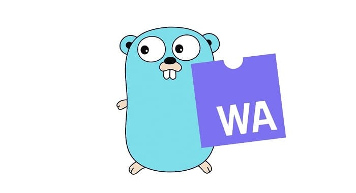
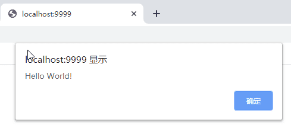
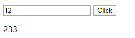
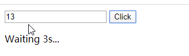

## 1 Introduction to WebAssembly

> WebAssembly is a new type of code that can be run in modern web browsers — it is a low-level assembly-like language with a compact binary format that runs with near-native performance, and it provides a compilation target for languages such as C/C++ so that they can run on the web. It is also designed to run alongside JavaScript, allowing both to work together.  —— [MDN web docs - mozilla.org](https://developer.mozilla.org/zh-CN/docs/WebAssembly)

From MDN's introduction, we can draw a few conclusions:

- 1) WebAssembly is a binary code format, not a new language.
- 2) WebAssembly is not meant to replace JavaScript, but to complement it (at least for now). Combined with its performance advantages, it will most likely be concentrated in scenarios that demand high performance (e.g. games, AI) or a highly interactive experience (e.g. mobile).
- 3) Languages such as C/C++ can compile to WebAssembly target files; in other words, other languages can, with compiler support, produce code that runs in the browser front end.

Go added native support for WebAssembly (Wasm) in version 1.11 (August 2018), which made developing WebAssembly applications with Go much simpler. This built-in support was an important milestone in Go's push into front-end development. Before that, if you wanted to do front-end development in Go, you needed [GopherJS](https://github.com/gopherjs/gopherjs), a compiler that translates Go into JavaScript code that can run in the browser. Newer versions of Go compile Go code directly into wasm binaries, with no need to go through JavaScript. As it happens, the people who implemented GopherJS and Go's built-in WebAssembly support are the same group of people.

Functions written in Go can be exported directly for JavaScript code to call. At the same time, Go ships with the [syscall/js](https://github.com/golang/go/tree/master/src/syscall/js) package, which lets you call JavaScript functions directly from Go, including DOM tree manipulation.

## 2 Hello World

If you are not familiar with Go, I recommend [A Gentle Introduction to Go](/en/post/quick-golang.html) — you can get started quickly with a single article.

Next, we'll use Go to implement the simplest possible program: popping up `Hello World` on a web page.

Step 1: create a file named main.go. Use js.Global().get('alert') to get the global alert object and call it via the Invoke method. It is equivalent to calling `window.alert("Hello World")` in JavaScript.

```go
// main.go
package main

import "syscall/js"

func main() {
	alert := js.Global().Get("alert")
	alert.Invoke("Hello World!")
}
```

Step 2: compile main.go into static/main.wasm

> If `GO MODULES` is enabled, you need to initialize a module with go mod init, or set GO111MODULE=auto.

```bash
$ GOOS=js GOARCH=wasm go build -o static/main.wasm
```

Step 3: copy wasm_exec.js (the JavaScript support file, needed when loading the wasm file) into the static folder

```bash
$ cp "$(go env GOROOT)/misc/wasm/wasm_exec.js" static
```

Step 4: create index.html, which references `static/main.wasm` and `static/wasm_exec.js`.

```html
<html>
<script src="static/wasm_exec.js"></script>
<script>
	const go = new Go();
	WebAssembly.instantiateStreaming(fetch("static/main.wasm"), go.importObject)
		.then((result) => go.run(result.instance));
</script>

</html>
```

Step 5: start the web server with goexec

> If goexec is not installed, you can install it with `go get -u github.com/shurcooL/goexec`, and you need to add $GOBIN or $GOPATH/bin to your environment variables.

The current directory structure looks like this:

```bash
demo/
   |--static/
      |--wasm_exec.js
      |--main.wasm
   |--main.go
   |--index.html
```

```bash
$ goexec 'http.ListenAndServe(`:9999`, http.FileServer(http.Dir(`.`)))'
```

Open localhost:9999 in your browser and a popup will appear, saying *Hello World!*.



To avoid typing those verbose commands on every build, you can put the whole process into a `Makefile`:

```makefile
all: static/main.wasm static/wasm_exec.js
	goexec 'http.ListenAndServe(`:9999`, http.FileServer(http.Dir(`.`)))'

static/wasm_exec.js:
	cp "$(shell go env GOROOT)/misc/wasm/wasm_exec.js" static

static/main.wasm : main.go
	GO111MODULE=auto GOOS=js GOARCH=wasm go build -o static/main.wasm .
```

With this, a single `make` is all it takes. The code has been uploaded to [7days-golang - github.com](https://github.com/geektutu/7days-golang/tree/master/demo-wasm).

## 3 Registering Functions

Calling JavaScript functions from Go is one side of the story. On the other side, if you are only using WebAssembly to replace performance-critical modules, you need to register functions so that other JavaScript code can call them.

Suppose we want to register a function that computes the Fibonacci sequence. Here is how to do it.

```go
// main.go
package main

import "syscall/js"

func fib(i int) int {
	if i == 0 || i == 1 {
		return 1
	}
	return fib(i-1) + fib(i-2)
}

func fibFunc(this js.Value, args []js.Value) interface{} {
	return js.ValueOf(fib(args[0].Int()))
}

func main() {
	done := make(chan int, 0)
	js.Global().Set("fibFunc", js.FuncOf(fibFunc))
	<-done
}
```

- fib is an ordinary Go function that computes the i-th Fibonacci number recursively. It takes an int argument and also returns an int.
- fibFunc is defined as a thin wrapper around fib: it reads the input from args[0], wraps the computed result with js.ValueOf, and returns it.
- js.Global().Set() registers fibFunc globally so that it can be called in the browser.

`js.Value` converts a JavaScript value into a Go value — for example, args[0].Int() converts it into a Go integer. `js.ValueOf` does the opposite: it converts a Go value into a JavaScript value. In addition, when registering a function, js.FuncOf converts it into a `Func`; only functions of type `Func` can be called from JavaScript. You can think of this as the interface/contract between Go and JavaScript.

`js.Func()` takes a function as its argument, and that function must be defined as:

```go
func(this Value, args []Value) interface{}
// this is the `this` in JavaScript
// args is the list of arguments used when the function is called in JavaScript.
// The return value must be mapped to a JavaScript value with js.ValueOf
```

In the main function, we create a channel (chan) named done, which blocks the main goroutine. If fibFunc is called from JavaScript, a new child goroutine is spawned to execute it.

> A wrapped function triggered during a call from Go to JavaScript gets executed on the same goroutine. A wrapped function triggered by JavaScript's event loop gets executed on an extra goroutine.  —— [FuncOf - golang.org](https://golang.org/pkg/syscall/js/#FuncOf)

Next, modify the previous index.html: add an input box (num), a button (btn) and a text element (ans, used to display the result), add a click event to the button that calls fibFunc, and display the computed result in the text element (ans).

```html
<html>
...
<body>
	<input id="num" type="number" />
	<button id="btn" onclick="ans.innerHTML=fibFunc(num.value * 1)">Click</button>
	<p id="ans">1</p>
</body>
</html>
```

Recompile main.go with the commands from before and start the web server on port 9999. If you have already put the commands into a Makefile, running `make` is all you need.

Now visit localhost:9999 and you will see the following. Enter a number and click `Click`; the computed result is displayed below the input box.



## 4 Manipulating the DOM

In the previous example, we only registered the global function fibFunc; event registration, invocation, and DOM manipulation were all done in HTML through native JavaScript functions. Can all of these things be done entirely in Go? The answer is yes.

First, modify index.html by removing the event registration and the DOM manipulation.

```html
<html>
...
<body>
	<input id="num" type="number" />
	<button id="btn">Click</button>
	<p id="ans">1</p>
</body>
</html>
```

Modify main.go:

```go
package main

import (
	"strconv"
	"syscall/js"
)

func fib(i int) int {
	if i == 0 || i == 1 {
		return 1
	}
	return fib(i-1) + fib(i-2)
}

var (
	document = js.Global().Get("document")
	numEle   = document.Call("getElementById", "num")
	ansEle   = document.Call("getElementById", "ans")
	btnEle   = js.Global().Get("btn")
)

func fibFunc(this js.Value, args []js.Value) interface{} {
	v := numEle.Get("value")
	if num, err := strconv.Atoi(v.String()); err == nil {
		ansEle.Set("innerHTML", js.ValueOf(fib(num)))
	}
	return nil
}

func main() {
	done := make(chan int, 0)
	btnEle.Call("addEventListener", "click", js.FuncOf(fibFunc))
	<-done
}
```

- DOM elements are obtained in one of two ways: `js.Global().Get("btn")` or `document.Call("getElementById", "num")`.
- btnEle calls `addEventListener` to bind the click event fibFunc to btn.
- Inside fibFunc, `numEle.Get("value")` reads the value of numEle (a string), which is converted to an integer before calling fib to compute the result.
- ansEle calls `Set("innerHTML", ...)` to render the computed result.

Recompile main.go and visit localhost:9999 — the behavior is exactly the same as before.

## 5 Callback Functions

In JavaScript, async + callbacks are extremely common: for example, you request a RESTful API, register a callback, and the callback logic runs once the data arrives, while the program can keep doing other things in the meantime. In Go, asynchrony can be achieved with goroutines.

Suppose computing fib takes a very long time. We can then register a callback and display the result only after fib has finished computing.

First, we modify main.go so that fibFunc accepts a callback function.

```go
package main

import (
	"syscall/js"
	"time"
)

func fib(i int) int {
	if i == 0 || i == 1 {
		return 1
	}
	return fib(i-1) + fib(i-2)
}

func fibFunc(this js.Value, args []js.Value) interface{} {
	callback := args[len(args)-1]
	go func() {
		time.Sleep(3 * time.Second)
		v := fib(args[0].Int())
		callback.Invoke(v)
	}()

	js.Global().Get("ans").Set("innerHTML", "Waiting 3s...")
	return nil
}

func main() {
	done := make(chan int, 0)
	js.Global().Set("fibFunc", js.FuncOf(fibFunc))
	<-done
}
```

- Assume the callback function is passed as the last argument when calling fibFunc; then it can be retrieved via args[len(args)-1]. This is no different from passing arguments of any other type.
- `go func()` spawns a child goroutine that calls fib to compute the result; once the computation finishes, it invokes the callback `callback` and passes the computed result to it. time.Sleep() simulates an operation that takes 3 seconds.
- Before the result is ready, the page first shows `Waiting 3s...`

Next, we modify index.html to add a click event to the button, calling fibFunc

```html
<html>
...
<body>
	<input id="num" type="number" />
	<button id="btn" onclick="fibFunc(num.value * 1, (v)=> ans.innerHTML=v)">Click</button>
	<p id="ans"></p>
</body>
</html>
```

- A click event is registered on btn; the first argument is the number to compute, taken from the num input box.
- The second argument is a callback function that displays the parameter v in the ans element.

Now, recompile main.go, visit localhost:9999, enter any number and click Click. The page first shows `Waiting 3s...`, and the computed result appears after 3 seconds.




## 6 Going Further

### 6.1 Tools and Frameworks

- [WebAssembly Code Explorer](https://wasdk.github.io/wasmcodeexplorer/), a binary analysis tool for WebAssembly
- Test Go Wasm code with Node.js or in the browser: [Github Wiki](https://github.com/golang/go/wiki/WebAssembly#executing-webassembly-with-nodejs)
- [Vugu](https://www.vugu.org/doc/start), a Golang WebAssembly front-end framework inspired by Vue — written entirely in Go, without writing any JavaScript code.

### 6.2 Demos/Projects

- Some [examples](https://stdiopt.github.io/gowasm-experiments/) of front-end rendering built with Go Assembly
- [jsgo](https://github.com/dave/jsgo) gathers a collection of small but polished projects, including games such as [2048](https://jsgo.io/hajimehoshi/ebiten/examples/2048) and [Tetris](https://jsgo.io/hajimehoshi/ebiten/examples/blocks), plus [TodoMVC](https://jsgo.io/dave/todomvc), proof that Go can build complete front-end projects.

### 6.3 Related Documentation

- [Official syscall/js documentation - golang.org](https://golang.org/pkg/syscall/js)
- [Official Go WebAssembly documentation - github.com](https://github.com/golang/go/wiki/WebAssembly)

> The Chinese original of this article is available at [geektutu.com/post/quick-go-wasm.html](https://geektutu.com/post/quick-go-wasm.html).
