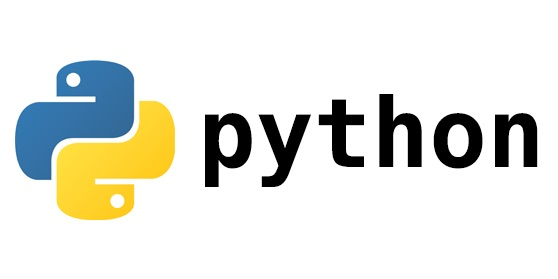

> Python is a programming language that lets you work more quickly and integrate your systems more effectively. -- [python.org](https://www.python.org)

## 0 Installation

You can download and install Python directly from the official site at [python.org/downloads](https://www.python.org/downloads/) — the latest version is 3.9.0. The installation process is the same as for any ordinary Windows program. After installing, add the installation path to your environment variables.

If you are on a Linux distribution such as Ubuntu, or on macOS, the operating system already ships with Python, so there is nothing to install. If your system only has Python 2, you can install Python 3 on Debian and Ubuntu like this:

```bash
sudo apt-get update && sudo apt-get install python3
```

On macOS, install it as follows:

```bash
brew install python3
```

If the installation succeeded, run `python -V` or `python3 -V` on the command line and you will see:

```bash
$ python3 -V
Python 3.7.5
```

## 1 Hello World

Python can be run in two ways: interactively or from a source file. Type `python3` on the command line and press Enter to enter the Python interpreter's interactive mode:

```bash
$ python3
Python 3.7.5 (default, Nov  7 2019, 10:50:52)
[GCC 8.3.0] on linux
Type "help", "copyright", "credits" or "license" for more information.
>>> 
```

Next, type `print("hello world")` and press Enter:

```bash
>>> print("hello world")
hello world
>>> 
```

That's our first Python program — saying hello to the world. `print()` is a built-in Python function that prints information to standard output.

In interactive mode, the result is printed on screen as soon as you enter a line of code and press Enter. So we can use Python as a simple calculator, for example:

```bash
>>> 1 + 2 * 100
201
>>> 1 + 2 ** 3
9
```

`**` is Python's exponentiation operator; here it means 2 raised to the power of 3.

Now create a folder named test on your desktop, and inside it create a file `main.py` containing:

```python
print("1 + 2 =", 1 + 2)
```

After saving, switch to the test folder on the command line and run `python main.py`. You will see:

```bash
$ python3 main.py
1 + 2 = 3
```

In practice we usually write Python programs in an IDE such as [VSCode](https://code.visualstudio.com/) or [PyCharm](https://www.jetbrains.com/pycharm/download). An IDE integrates features like syntax highlighting, code hints, and a terminal, which greatly improves both learning and development efficiency.

## 2 Basic Syntax

```python
ok = True # a boolean value, either True or False
a = 2
b = 3.56
c = "hello world"
d = a * b # the product of a and b
print("c =", c)
print('{0} + {1} = {2}'.format(a, b, d))
```

Running this program:

```bash
python3 main.py
c = hello world
2 + 3.56 = 7.12
```

- A single-line comment starts with the `#` symbol.
- A variable name is usually made up of digits, letters, and underscores, but it can only start with a letter or an underscore.
- `ok = True` assigns the literal boolean value True to the variable ok.
- `a = 2` assigns the literal integer 2 to the variable a.
- `b = 3.56` assigns the literal floating-point number 3.56 to the variable b.
- `c = "hello world"` assigns the string hello world to the variable c.

Single-line strings are usually written with double quotes `"`, but single quotes `'` work too. Multi-line strings typically use three single quotes or three double quotes. For example:

```python
a = "I'm geektutu"
b = 'c = "hello world"'
d = """This is a multi-line string;
this is the second line;
and this is the third line.
"""
print(a)
print(b)
print(d)
```

The output is:

```bash
$ python3 main.py
I'm geektutu
c = "hello world"
This is a multi-line string;
this is the second line;
and this is the third line.

```

`format` can format strings: `{0}` is replaced by the first argument passed to format, `{1}` by the second, and so on.

format supports other usage patterns as well — omitting the index, or using key-value pairs:

```python
name, age = "Ming", 13 # several variables can be declared on one line
print("{} is {} years old this year".format(name, age)) # used in order, the index in {} can be omitted
print("{name} will be {age} years old next year".format(name=name, age=age+1)) # using key-value pairs
```

The output:

```bash
$ python3 main.py
Ming is 13 years old this year
Ming will be 14 years old next year
```

If the code is written incorrectly, Python will report an error when it runs. For example:

```python
age = 13
print("This year { years old\nnext year {} years old".format(age, age+1)) # \n prints a newline
```

```bash
python3 main.py
Traceback (most recent call last):
  File "main.py", line 2, in <module>
    print("This year { years old\nnext year {} years old".format(age, age+1))
ValueError: unexpected '{' in field name
```

When an error occurs, a stack trace is printed:

- `File "main.py", line 2` means the error happened on line 2 of `main.py`.
- `ValueError: unexpected '{' in field name` means the error is caused by a misused `{` brace. Here we did not use a matching pair of braces as a placeholder, which triggered the error.

## 3 Operators and Expressions

### 3.1 Operators

The familiar arithmetic operations:

```python
>>> 1 + 2 # addition
3
>>> 4 - 6 # subtraction
-2
>>> 2 * 3 # multiplication
6
>>> 6 / 4 # division
1.5
>>> 6 // 4 # division, rounded down
1
>>> 6 + 2 * (1 + 3) # the order of evaluation is the same as in regular math: parentheses first, then multiplication/division, then addition/subtraction
14
>>> 2 ** 4 # exponentiation, 2 to the power of 4
16
>>> 6 % 4 # modulo / remainder
2
```

Comparison operators:

```python
>>> 12 < 18 # less than
True
>>> 12 <= 18 # less than or equal to
True
>>> 1.2 > 3.4 # greater than
False
>>> 1.2 >= 3.4 # greater than or equal to
False
>>> 12 == 18 # equal to
False
>>> 12 != 18 # not equal to
True
```

Logical operators:

```python
>>> 12 >= 8 and 5 > 6 # and: boolean AND, true only if both sides are true
False
>>> 12 >= 8 or 5 > 6 # or: boolean OR, false only if both sides are false
True
>>> not 5 > 6 # not: boolean negation
True
```

Bitwise operators such as `<<` (left shift), `>>` (right shift), `&` (bitwise AND), `|` (bitwise OR), `^` (bitwise XOR), and `~` (bitwise NOT) are also supported.

The assignment operator `=` assigns the value on its right side to the left side, which must be a variable.

```python
a = 2
a = a * (3 + 4) # assigns the value of a * (3 + 4), 14, to a.
```

When you compute with a variable and assign the result back to the same variable, you can write it in shorthand:

```python
a = 2
a *= 3 + 4
```

### 3.2 Expressions

In Python, a combination of values, variables, and operators is called an expression, and the program statements we write usually contain several expressions. For example, `3 + 4` above forms a simple expression. Values and variables are also known as operands, and operators as operations.

## 4 Control Flow

Python statements run from top to bottom. What if, along the way, we want to run different logic depending on some conditions? That is what control flow statements are for. Python has three control flow statements: `if`, `for`, and `while`.

### 4.1 The if Statement

`if` checks whether a condition is true and executes the block if it is. It is usually combined with `else` and `elif` (else if). For example:

```python
age = 13
if age >= 18:
    print('adult')
if age < 18:
    print('child')
```

Python uses indentation to delimit code blocks; the convention is 4 spaces. You can see the 4 spaces before `print()`.

The code above can be simplified to:

```python
age = 13
if age >= 18:
    print('adult')
else:
    print('child')
```

When you have multiple condition branches, `elif` comes in handy:

```python
age = 45
if age < 18:
    print('child')
elif age < 60:
    print('middle-aged')
else:
    print('senior')
```

### 4.2 The for Statement

Some code blocks need to run multiple times. In that case we can use the `for` loop statement, for example to print the numbers 1 to 5:

```python
# main.py
for i in range(5): # 0, 1, 2, 3, 4 — starts at 0, excludes 5
    print(i + 1, end=' ')
```

The output is:

```bash
python3 main.py
1 2 3 4 5
```

- The `print()` function ends with a newline character by default. If we want a space instead, we only need to set the end argument to a space.
- `range()` is also a built-in function, used to generate a sequence of numbers, and is commonly used in for loops. With a single argument N, it generates the sequence of integers `[0, N)` — starting from 0 and excluding N. What if we don't want to start from 0? `range()` also accepts multiple arguments, for example:

```python
for i in range(2, 5): # [2, 5)
    print("{0} * {0} = {1}".format(i, i ** 2))

# The output is as follows
# 2 * 2 = 4
# 3 * 3 = 9
# 4 * 4 = 16

for i in range(1, 10, 2): # the third argument is the step; starts at 1 and adds 2 each time
    print(i, end=' ')
# 1 3 5 7 9
for i in range(10, 2, -2): # step -2, starts at 10 and adds -2 each time
    print(i, end=' ')
# 10 8 6 4
```

And what if, inside a for loop, you want to exit the loop when some condition is met? Usually `for` is also combined with `break` and `continue`:

```python
for i in range(100):
    if i <= 3:
        continue # i <= 3: keep looping without executing the statements below
    if i >= 10:
        break    # i >= 10: stop the loop
    print(i, end=' ')
# 4 5 6 7 8 9
```

- The `continue` statement skips the rest of the current iteration and continues with the next iteration of the loop.
- The `break` statement terminates the loop.
- Therefore, when `i <= 3` the print statement is skipped, and when `i >= 10` the loop is terminated, so this program prints the numbers 4 5 6 7 8 9.

### 4.3 The while Statement

Like the `for` loop, `while` is typically used for looping. `while` is followed by a condition: while the condition is true, the while block executes; once it is false, the loop terminates. In general, a while loop can replace a for loop. We just printed the numbers 1 to 5 with a for loop; here is the same thing rewritten with while:

```python
i = 0
while i < 5: # on the 1st iteration i == 0, so the condition holds; on the 6th iteration i == 5, so it fails
    i += 1
    print(i, end=',')
# 1,2,3,4,5,
```

Likewise, the `continue` and `break` statements can also be used inside `while`. For example, let's implement a simple feature: each time the user enters a number, print its square, until 0 is entered.

```python
while True:
    num = input('Enter a number: ')
    num = int(num)
    if num == 0:
        print('Done')
        break
    print("{}^2 = {}".format(num, num ** 2))
```

The output:

```bash
python3 main.py
Enter a number: 12
12^2 = 144
Enter a number: 18
18^2 = 324
Enter a number: 0
Done
```

- `while True` enters an infinite loop, which can only be ended with a `break` statement.
- `input()` is a built-in function that reads user input and returns a string. input accepts a string that is shown as the input prompt.
- `num = int(num)` converts num to an integer, because a string cannot be squared — only numbers can.

## 5 Functions

In the previous examples we have already used common built-in functions like `print`, `range`, and `input`, so functions are nothing new to us. What exactly is a function? A function is a reusable block of code. You can give it a name (the function name), define the parameters it takes (formal parameters), and return a result (the return value). A function definition generally looks like this: the keyword `def` marks the function, followed by the function name. Function names follow the same rules as variables — usually composed of digits, letters, and underscores, starting with a letter or an underscore. After the function name come a pair of parentheses and a colon `:`, in which a parameter list can be defined (or no parameters at all). What follows is a block of statements forming the function body.

```python
def function_name(param1, param2, ...):
    body # the function body is also indicated by indentation
```

For example, let's implement a function `area` that computes the area of a rectangle. It takes two arguments, the length `length` and the width `width`, and returns one value, the area.

```python
def area(length, width):
    return length * width

print('area1: ', area(10, 8)) # 80, first call
print('area2: ', area(6, 8)) # 48, second call
```

- `return` is a Python keyword used inside a function body; it exits the function immediately and stops execution.
- `return` can be followed by one or more values to return, or by nothing at all.
- When there is no return value, `return` is in fact equivalent to `return None`. `None` is a keyword that represents nothingness.
- If a function has no `return` statement, the system automatically adds `return None` at the end of the function.

```python
def calc(a, b):
    return a // b, a % b # multiple return values — actually a tuple, introduced in a later chapter

print(calc(8, 3)) # (2, 2)

x, y = calc(8, 5) # the two return values are assigned to the variables x and y respectively
print(x, y) # 1, 3
```

```python
def log(mode):
    if mode == 'debug':
        print('debug mode')
        return
    print('release mode')

print(log('release')) 
# release mode
# None
```

### 5.1 Local and Global Variables

```python
x = 10 # x is a global variable, usable in other functions

def print_global():
    print(x)

def print_local():
    x = 100 # x is a local variable; it does not affect the global x
    print(x)

print_global() # 10
print_local() # 100
print_global() # 10
```

We defined a global variable x, and inside `print_local` defined a local variable with the same name as the global variable, assigning 100 to it. What is modified here is the local variable; it is only valid inside this function, and the global variable is unaffected. That is why both calls to `print_global` print 10.

The benefit of local variables is that they limit a variable's scope and reduce interference between functions. Global variables can be shared across functions, but as a rule of thumb, only read-only values should be global variables, such as the value of pi `π`. What if we do want to modify a global variable? We can use the `global` keyword:

```python
x = 10 # x is a global variable, usable in other functions

def print_global():
    print(x)

def print_local():
    global x
    x = 100
    print(x)

print_global() # 10
print_local() # 100
print_global() # 100
```

Inside `print_local`, `global x` tells Python that x is a global variable rather than a local one. Therefore `x = 100` modifies the value of the global variable x, and the second `print_global()` prints 100.

### 5.2 Optional Parameters and Default Values

If a function has multiple parameters, can some of them be given default values, so that the caller may choose whether to pass them? The answer is yes. Python allows parameters to have default values; to the caller this looks just like function overloading in C++.

> An overloaded function is a special case of functions. For convenience, C++ allows several functions with the same name and similar functionality to be declared in the same scope, but their formal parameters (the number, types, or order of the arguments) must differ. In other words, the same function name is used to accomplish different tasks — that is function overloading.

```python
def greet(msg, times=1):
    for i in range(times):
        print(msg)

greet('Hi, Jack')
greet('Hello, Mr Dai', 3)
```

The output:

```bash
Hi, Jack
Hi, Tom
Hi, Tom
Hi, Tom
```

- The `greet` function prints msg, once by default, controlled by the times parameter.
- Parameters with default values can only appear at the end of the parameter list, not before parameters without default values. For example, `def greet(times=1, msg)` is not allowed.
- There can be zero or more parameters with default values.

In Python, argument passing can be even more flexible. Besides passing arguments in order, you can also pass them as key-value pairs:

```python
greet('Hi, Jack', times=2) # mixed style
greet(msg='Hi, Tom', times=3)
greet(times=3, msg='Hi, Tom') # when everything is passed as key-value pairs, the order does not matter
```

Key-value arguments are especially useful when the parameter list is long and most parameters have defaults. You don't need to care about the order of the parameters — just pass the few you want to set.

### 5.3 Variable-Length Arguments

Python also supports variable-length arguments. If the number of arguments is unknown when defining a function, variable-length arguments are the right tool. There are two kinds: tuple-style (a tuple can be thought of as an immutable ordered collection) and dictionary-style (dict). Tuple-style variable arguments are written `*name`, and the actual arguments passed in are collected into a tuple. For example:

```python
# a sum function that accepts any number of numbers
def sum_n(*nums):
    s = 0
    for num in nums:
        s += num
    return s

print(sum_n(1, 2, 3)) # 6
print(sum_n(1, 2, 3, 4, 5)) # 15
```

Dictionary-style (key-value style) variable arguments are written `**name`, and the actual arguments passed in are collected into a dictionary (dict). For example:

```python
def print_student(**students):
    for name, age in students.items():
        print('{} is {} years old'.format(name, age))

print_student(ming=8, hong=7)
```

The output:

```bash
ming is 8 years old
hong is 7 years old
```

> Tuples and dicts are both built-in Python data structures, covered in the next chapter.

### 5.4 Docstrings `__doc__`

Writing documentation for every function is a good programming habit. In Python, every function has a built-in attribute `__doc__` that stores the function's documentation, called `DocStrings` in Python. So how do you define this attribute?

```python
def print_student(**students):
    '''Prints name and age for every student.

    key is name, and value is age.'''
    for name, age in students.items():
        print('{} is {} years old'.format(name, age))

print_student(ming=8, hong=7)
print(print_student.__doc__) # print the value of __doc__
help(print_student)
```

- The function body starts with three single quotes `'''`, which mark the beginning of the DocStrings.
- The first line describes what the function does and starts with a capital letter. The second line is blank, and the third line is the detailed description, which may include an introduction to each of the function's parameters.

The output:

```bash
ming is 8 years old
hong is 7 years old
Prints name and age for every student.

    key is name, and value is age.
```

```bash
Help on function print_student in module __main__:

print_student(**students)
    Prints name and age for every student.
    
    key is name, and value is age.
```

- The `help()` function is also a Python built-in. It provides a nicer way to view a function's DocStrings and is typically used in interactive mode.

## 6 Data Structures

Python ships with several commonly used data structures: the list, the tuple, the dict, and the set. Almost every program uses these.

### 6.1 String (string)

Strings are arguably the most commonly used data type. A string can be written with `"`, `'`, `"""`, or `'''`; triple quotes are usually used for multi-line strings. A string is a sequence of characters, and in Python sequences support subscript indexing, for loops, slicing, and other operations — the lists and tuples mentioned later are sequences too. Strings are an immutable data type and do not support modification.

```python
s = "I'm geektutu"
print(len(s)) # 12
print(s[0], s[-1]) # I u
```

The `[]` operator indexes into a sequence by position, starting from 0. Negative indexes are supported: -1 refers to the last element, and so on. Besides indexing, `[]` can also be used for slicing. For example:

```python
s = "I'm geektutu"
print(s[:-3]) # I'm geekt, equivalent to s[0:-3]
print(s[4:]) # geektutu, equivalent to print(s[4:len(s)])
print(s[4::2]) # gett
print(s[::-1]) # tutkeeg m'I
```

Slicing quickly extracts a portion of a sequence. Its form is `[start:end:step]`, similar to range: the start is included, the end is not.

- `start` defaults to 0, and when it is 0 it can be omitted.
- `end` defaults to the length of the sequence, and when it is the length it can be omitted.
- `step` defaults to 1, and when it is 1 it can be omitted.

### 6.2 List (list)

`list` is a data structure representing an ordered collection of items. It keeps its order, allows duplicates, supports insertion, deletion, lookup, and modification, and is a mutable data type.

```python
persons = list() # declare an empty list
persons = [] # declare an empty list
persons = ['Tom', 'Jack', 'Jack', 'Sam'] # declare a non-empty list
persons.append('KangKang') # add an element
print(persons[1]) # Jack — prints the element at index 1, counting from 0
persons.remove('Jack') # remove Jack, only the first occurrence
print(persons)  # ['Tom', 'Jack', 'Sam', 'KangKang']
del persons[-2] # delete the second-to-last element, Sam
print(persons) # ['Tom', 'Jack', 'KangKang']

persons.sort() # sort
# iterate over the list
for name in persons:
    print(name, end=' ') # Jack KangKang Tom
```

- `append` adds an element, `remove` deletes an element by value, and `del` deletes an element by index.
- `sort()` sorts the list.

Like strings, lists are sequences, so they support slicing too.

```python
numbers = [2, 4, 6, 8, 10]
print(len(numbers)) # length 5
print(numbers[:3]) # 2 4 6
print(numbers[0:3]) # 2 4 6
print(numbers[1:-1]) # 4 6 8
print(numbers[1:]) # 4 6 8 10
print(numbers[1:5:2]) # 4 8
print(numbers[1::2]) # 4 8
```

The values in a list can be of any type, a single list may contain values of different types, and nested lists are allowed as well.

```python
a = [1, 1.3, "Student", [1, 2, 3]]
```

To check whether a value is in a list, use `in`:

```python
print("Student" in a) # True
```

A very common combination for processing lists and strings is `split` and `join`:

```python
s = "1,5,2,4,3"
parts = s.split(',')
print(parts) # ['1', '5', '2', '4', '3']
parts.sort()
print(':'.join(parts)) # 1:2:3:4:5
```

- `split` splits a string into a list using a given separator.
- `join` merges a list of strings together using a given separator.

> For more operations on lists, see the [list — official Python documentation](https://docs.python.org/3/tutorial/datastructures.html).

### 6.2 Tuple (tuple)

A tuple is also an ordered collection, written with parentheses. Many of its features are the same as a list's; the difference is that a tuple is immutable — items cannot be added, removed, or modified.

```python
students = ('Tom', 18, 'Jack', 20)
print(len(students))  # 4
print(students[1:3]) # slicing: (18, 'Jack')
```

If you try to modify a tuple, you get the following error:

```bash
students[0] = 'KangKang'
Traceback (most recent call last):
  File "main.py", line 4, in <module>
    students[0] = 'KangKang'
TypeError: 'tuple' object does not support item assignment
```

> For more operations on tuples, see the [tuple — official Python documentation](https://docs.python.org/3/tutorial/datastructures.html#tuples-and-sequences).

### 6.4 Dictionary (dict)

A dictionary consists of a number of key-value pairs and can quickly find the value corresponding to a given key. Within a dictionary, keys cannot be duplicated. The dictionary is a mutable data type and supports insertion, deletion, lookup, and modification.

```python
students = {} # declare an empty dict
students = dict() # declare an empty dict
students = {
    'Tom': 18,
    'Jack': 20,
    'Same': 19
}

students['KangKang'] = 17 # add
students['Tom'] = 20 # update
print(students['Tom']) # 20, indexed by key
del students['Jack'] # delete

# iterate
for name, age in students.items():
    print(name, age)
# Tom 20
# Same 19
# KangKang 17
```

- `items()` retrieves the keys and values together. Beyond that, the dict also provides methods that fetch only the keys `keys()` or only the values `values()`. A dict is unordered, so the order of these three methods' results is not guaranteed.

- To check whether a dict contains a key, use `in` as well, e.g. `if 'Tom' in students`.
- To get the number of key-value pairs in a dict, use `len`, e.g. `len(students)`.

> For more operations on dictionaries, see the [dict — official Python documentation](https://docs.python.org/3/tutorial/datastructures.html#dictionaries).

### 6.4 Set (set)

Sets in Python are like sets in mathematics: they are unordered and contain no duplicates.

```python
s = set() # define an empty set
s1 = set([1, 2, 2, 2, 3]) # a non-empty set
s1.add(2) # add an element; duplicates are ignored
s1.add(10)
s1.remove(3) # delete
print(s1) # {10, 1, 2}

s2 = set([5, 6, 10])

print(s1 | s2) # union {1, 2, 5, 6, 10}
print(s1 & s2) # intersection {10}
print(s1 - s2) # difference {1, 2}
```

- `set([1, 2, 2, 2, 3])` converts a list to a set, removing duplicates automatically; likewise, `list()` converts a set back to a list.

> For more operations on sets, see the [set — official Python documentation](https://docs.python.org/3/tutorial/datastructures.html#sets).

## 7 Input and Output

In the previous examples we built simple features with the standard input/output functions `input` and `output`. Python is often used for data mining and analysis, where text processing is the most basic capability, and reading and writing files in Python is very simple.

Here is a very simple example: write the string s to the file `1.txt`.

```python
s = '''Line 1
Line 2
Line 3'''

f = open('1.txt', 'w')
f.write(s)
f.close()
```

- `open` is Python's built-in function for reading files. The first argument is the file path and the second is the open mode: `w` stands for write mode and `r` for read-only mode. When a file is opened in `w` mode its contents are cleared; if you need to append, you must open the file in `w+` mode.
- If the file is opened successfully, `open` returns a file handle, which we can use to operate on the file.
- When the operations are done, the file must be closed.

Python also offers another, safer and simpler way: `with as`.

```python
s = '''Line 1
Line 2
Line 3'''

with open('1.txt', 'w') as f:
    f.write(s)
```

The `with` statement performs resource cleanup once the code block inside `with` finishes — for a file, that means closing it.

Read the file and count the characters:

```python
with open('1.txt', 'r') as f:
    s = f.read()
    print(len(s)) # 20
```

We can also use `readlines()` to read all the lines of a file:

```python
with open('1.txt', 'r') as f:
    s = f.readlines()
    for line in s:
        print(line, end='')
```

There is an even more efficient way — iterate over the file handle `f` directly:

```python
with open('1.txt', 'r') as f:
    for line in f:
        print(line, end='')
```

## 8 Exceptions

No matter how carefully we write our code, exceptions are bound to happen. If we don't handle them at all, the program exits immediately. Python provides the `try except finally` mechanism, giving developers a chance to handle exceptions.

```python
# main.py
with open('2.txt', 'r') as f:
    print(f.read())
print('done')
```

If we run the program above, we get the following error:

```bash
Traceback (most recent call last):
  File "main.py", line 2, in <module>
    with open('2.txt', 'r') as f:
FileNotFoundError: [Errno 2] No such file or directory: '2.txt'
```

The program exits at line 2 because `2.txt` does not exist. How do we catch this error and handle it?

```python
# main.py
try:
    with open('2.txt', 'r') as f:
        print(f.read())
except Exception as e:
    print(e)
finally:
    print('done')
```

The program now finishes normally:

```bash
[Errno 2] No such file or directory: '2.txt'
done
```

- The `try` block contains the code that may raise an exception; if an exception occurs, execution jumps to the `except` block.
- The code in `finally` runs whether or not an exception occurred; `finally` is optional.

We can also handle the exception in `except` and then re-raise it, leaving it to the caller to deal with.

```python
# main.py
try:
    with open('2.txt', 'r') as f:
        print(f.read())
except Exception as e:
    print(e)
    raise e
finally:
    print('done')
```

The output:

```bash
[Errno 2] No such file or directory: '2.txt'
done
Traceback (most recent call last):
  File "main.py", line 7, in <module>
    raise e
  File "main.py", line 3, in <module>
    with open('2.txt', 'r') as f:
FileNotFoundError: [Errno 2] No such file or directory: '2.txt'
```

## 9 Modules

### 9.1 Using Standard Library Modules

The Python standard library includes a large number of modules offering a rich set of features. Take the math library `math`, for example:

```python
import math

print(math.__name__) # module name: math
print(math.ceil(4.3)) # 5, rounds up
print(math.floor(4.8)) # 4, rounds down
```

- `import` imports the standard library `math`, and we call its `ceil` and `floor` functions.
- Every module has a built-in attribute `__name__` holding the module's name. If the module is being run standalone, its name is `__main__`.

For example, running `main.py`:

```python
# main.py
print(__name__)
if __name__ == '__main__':
  	print('running the module standalone')
```

produces:

```bash
__main__
running the module standalone
```

If an imported module name clashes with something, you can use `as` to give the module an alias:

```python
import math as math2

print(math2.__name__) # module name: math
print(math2.ceil(4.3)) # 5, rounds up
print(math2.floor(4.8)) # 4, rounds down
```

Sometimes the imported module's path is deeply nested; you can use `from xxx import xxx` to shorten the import path:

```python
import os
print(os.path.join('/tmp', 'a', 'b'))
# can be replaced with
from os import path
print(path.join('/tmp', 'a', 'b'))
```

### 9.2 Using Your Own Modules

Create a new file `calc.py` and implement the following function in it:

```python
def area(length, width):
    return length * width

print('this is calc module')

if __name__ == '__main__':
    assert(area(3, 4) == 12)
    print('test done')
```

Run `python calc.py` and it prints:

```bash
this is calc module
test done
```

In `main.py` we can import the module `calc` and use it. In Python, any `.py` file can be treated as a module:

```python
import calc

if __name__ == '__main__':
    print(calc.__name__)
    print(calc.area(5, 10))
```

Run `python main.py` and it prints:

```bash
this is calc module
calc
50
```

When a module is imported, its code is executed, which is why `this is calc module` is printed, but `test done` is not.

When `calc.py` is imported as a module, the `__name__` attribute equals the file name, i.e. `calc`, so the `if` branch is not entered. When it is executed standalone, `__name__` is `__main__`, so the `if` branch is entered and `test done` is printed.

We can take advantage of this: run some code — such as simple test logic — when the module is executed standalone, without affecting its behavior when imported.

### 9.3 Using Third-Party Modules

Python has a very rich ecosystem of third-party modules, such as the famous web scraping framework `scrapy`, the math foundation library `numpy`, and the data-processing powerhouse `pandas`. To use a third-party module, just install it with the `pip` command.

For example, to install numpy:

```bash
pip3 install numpy
```

If your machine has both Python 2 and Python 3 installed, use the following to install for a specific Python version:

```bash
python3 -m pip install numpy
```

If downloads are too slow (e.g. from mainland China), you can specify a mirror with the `-i` option:

```bash
pip3 install numpy -i https://pypi.tuna.tsinghua.edu.cn/simple
```

Once installed, `numpy` can be used just like the standard library:

```python
import numpy as np

a = np.array([[1, 2, 3], [4, 5, 6]])
b = np.array([[1, 5, 8], [2, 5, 6]])
print (a - b) # subtract the two matrices
# [[ 0 -3 -5]
#  [ 2  0  0]]
```

## 10 Object-Oriented Programming

Python is a language that supports both procedural and object-oriented programming.

> Object-oriented, as opposed to procedural, is a method that organizes related data and methods into a single whole and models systems at a higher level, closer to the natural way things work.

The three key characteristics of object-oriented programming:

- Encapsulation: hide an object's attributes and implementation details, exposing only public ways to access it.
- Inheritance: a subclass inherits methods from its parent class, so the subclass shares the parent's behavior.
- Polymorphism: the same operation applied to different objects can be interpreted differently and produce different results.

### 10.1 Classes and Objects

In Python, the keyword `class` declares a class, which usually inherits from the base class `object`:

```python
class Student(object):
    def __init__(self, name, age):
        self.name = name
        self.age = age
    
    def hello(self):
        print('Hi, I am {}, {} years old this year'.format(self.name, self.age))

if __name__ == '__main__':
    jack = Student('Jack', 18)
    jack.hello()
```

- Methods declared inside a class are instance methods by default; the first parameter, `self`, represents the instance itself and is omitted when calling.
- `__init__` is the class's constructor. Its first parameter is `self`, and the remaining parameters are declared as needed. Calling `ClassName(args)` creates an instance of the class. `name` and `age` are instance variables — they belong to the instance and are not shared with other instances.
- Other methods are declared much like ordinary functions; the only difference is that an instance method can access the instance's attributes and call its other methods through the `self` parameter.

### 10.2 Class Methods and Class Variables

Instance methods and instance variables are attached to object instances. The counterparts are class methods and class variables, which are shared by all instances of the class and can be accessed either as `ClassName.method` or `instance.method`.

```python
class Student(object):
    school = 'Oriental Primary School' # class variable

    def __init__(self, name, age):
        self.name = name # instance variable
        self.age = age   # instance variable
    
    def hello(self):
        print('Hi, I am {}, {} years old this year'.format(self.name, self.age))
    
    @classmethod
    def print_school(cls): # class method
        print(cls.school)

if __name__ == '__main__':
    jack = Student('Jack', 18)
    tom = Student('Tom', 20)
    jack.print_school()
    tom.print_school()

    Student.school = 'Dongming Primary School' # modify the class variable
    jack.print_school() # Dongming Primary School
    tom.print_school()  # Dongming Primary School
```

- Instance variables are declared inside the constructor `__init__`; class variables are declared outside it.
- Methods declared inside a class are instance methods by default; use `@classmethod` to declare a class method, whose first parameter `cls` represents the class itself.

### 10.3 Static Methods

There is another kind of method that accesses neither instance variables and methods nor class variables and methods — it is merely a helper function. For example, an instance method may have grown so long that you want to extract part of it into a separate method to improve readability. This helper is only useful to this class, not to others. In that case, we usually declare it as a static method.

```python
class Student(object):
    def __init__(self, name, age):
        self.name = name # instance variable
        self.age = age   # instance variable
    
    def hello(self):
        print('Hi, I am {}, {} years old this year'.format(self.name, self.age))
    
    @staticmethod
    def help_func():
        print('I am a static method')

if __name__ == '__main__':
    jack = Student('Jack', 18)
    Student.help_func()
    jack.help_func()
```

- A static method is declared with `@staticmethod` and is no different from an ordinary global function. It can be called as `ClassName.method` or `instance.method`. Unlike instance and class methods, it has no `self` or `cls` parameter.

### 10.4 Inheritance

```python
class Rectangle(object):
    def __init__(self, length, width):
        self.length = length
        self.width = width
    
    def area(self):
        return self.length * self.width

class Square(Rectangle):
    def __init__(self, length):
        super(Square, self).__init__(length, length)

if __name__ == '__main__':
    s = Square(4)
    print(s.area())
```

- `Square` inherits from `Rectangle`, so it has all of `Rectangle`'s attributes and methods.
- `Square` can override parent-class methods as needed; here `Square` overrides the parent's constructor, changing the parameter list from 2 arguments to 1.
- A subclass can call a parent-class method via `super(ChildClassName, self).method`.

## 11 Unit Testing

Writing unit tests for every module is an excellent habit, and Python ships with a built-in unit testing library, `unittest`.

Create a new file `calc.py` implementing two functions, area and volume:

```python
def area(length, width):
    if length < 0 or width < 0:
        return 0
    return length * width

def volume(length, width, height):
    if length < 0 or width < 0 or height < 0:
        return 0
    return length * width * height
```

Create the file `calc_test.py` and add test cases:

```python
import unittest
import calc

class TestCalc(unittest.TestCase):
    def test_area(self):
        self.assertEqual(calc.area(10, -1), 0)
        self.assertEqual(calc.area(10, 8), 80)

    def test_volume(self):
        self.assertEqual(calc.volume(2, -1, 4), 0)
        self.assertEqual(calc.volume(2, 3, 4), 24)

if __name__ == '__main__':
    unittest.main()
```

- Adding test cases is very simple: define a class that inherits from `unittest.TestCase`, then define one or more methods whose names start with `test_`. Every `test_`-prefixed method counts as one test case — this is the unittest framework's convention.
- Inside a test case, you can use assertions such as `assertEqual` and `assertTrue` to check expected output.
- `unittest.main()` loads and runs all the cases defined in the module.

```bash
$ python3 calc_test.py 
..
----------------------------------------------------------------------
Ran 2 tests in 0.000s

OK
```

The following forms let you test a specific module, a specific test class, or even a single test case:

```bash
python -m unittest test_module1 test_module2
python -m unittest test_module.TestClass
python -m unittest test_module.TestClass.test_method
```

`python3 calc_test.py` is equivalent to `python3 -m unittest calc_test`. If you only want to run the `test_volume` method, call it like this:

```bash
python3 -m unittest calc_test.TestCalc.test_volume
```

### 11.1 setUp and tearDown

Sometimes each test case needs the same preparation before it runs and the same cleanup after — opening and closing a file, for instance. Calling them in every case would be extremely tedious. Like other testing frameworks, unittest provides `setUp` and `tearDown` to run some instructions before and after each test case. unittest also provides two class-level methods, `setUpClass` and `tearDownClass`, to run instructions before and after all the test cases in a test class.

```python
import unittest

class TestCalc(unittest.TestCase):
    @classmethod
    def setUpClass(cls):
        print('before all tests')
    
    @classmethod
    def tearDownClass(cls):
        print('after all tests')

    def setUp(self):
        print('before each test')
    
    def tearDown(self):
        print('after each test')

    def test_1(self):
        pass

    def test_2(self):
        pass
    
if __name__ == '__main__':
    unittest.main()
```

The output is as follows:

```bash
$ python3 -m unittest calc_test
before all tests
before each test
after each test
.before each test
after each test
.after all tests

----------------------------------------------------------------------
Ran 2 tests in 0.000s

OK
```

> For more on unit testing, see the [unittest — official Python documentation](https://docs.python.org/3/library/unittest.html).

## Notes

This article is hosted on [GitHub](https://github.com/geektutu/geektutu.github.io) — typo fixes and PRs are welcome. Thanks for reading.

> The Chinese original of this article is available at [geektutu.com/post/quick-python.html](https://geektutu.com/post/quick-python.html).
